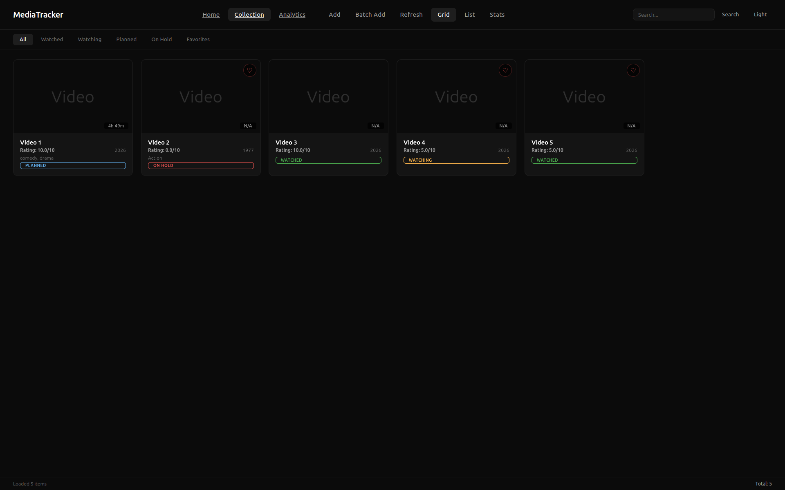
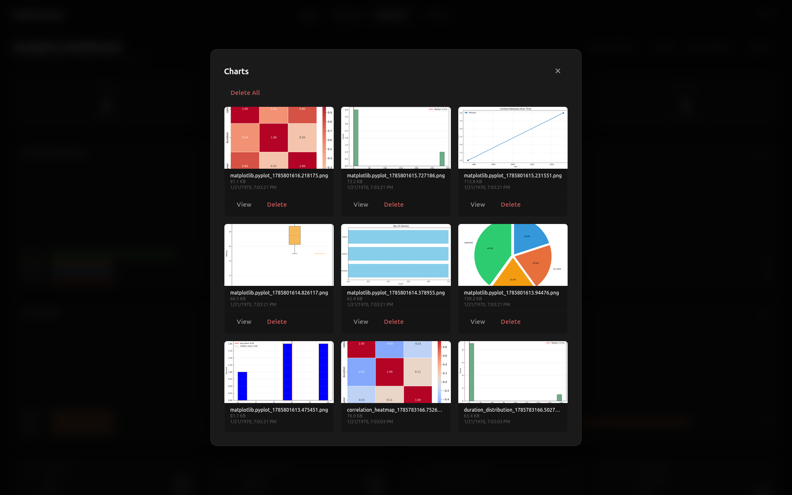
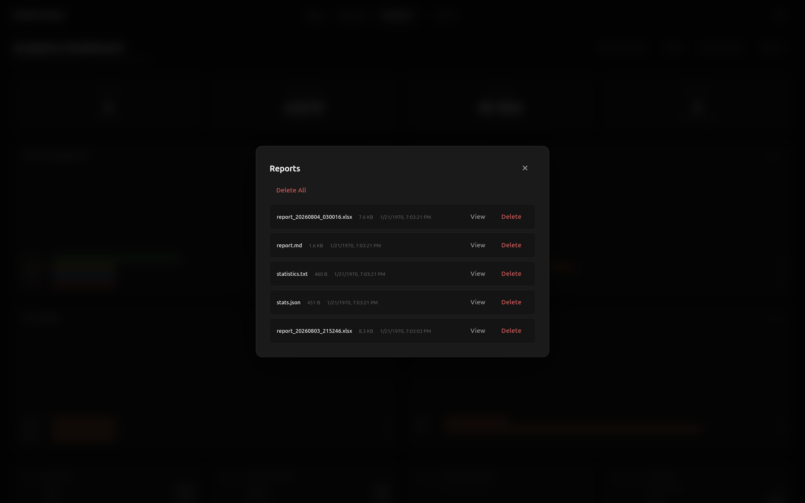
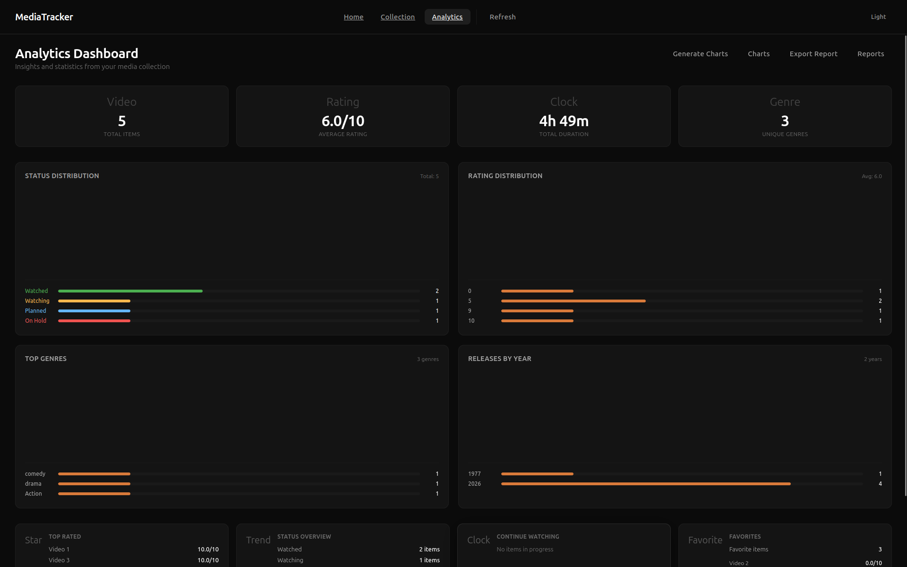
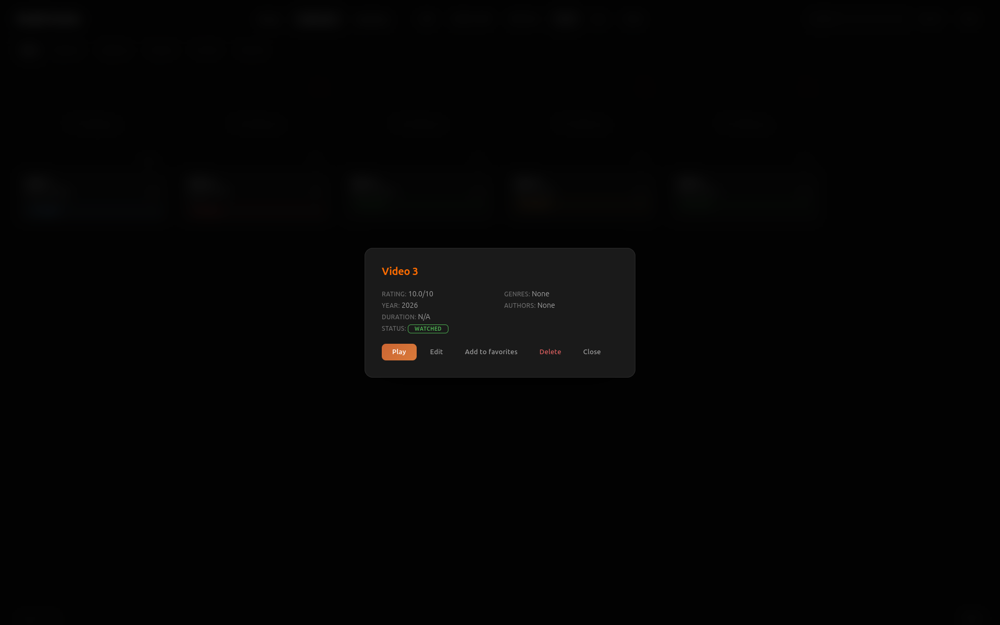

<div align="center">

<!-- ===== NEON FRAME ===== -->
<table border="0" cellpadding="0" cellspacing="0" style="border-collapse: collapse; width: 100%;">
<tr>
<td style="border: 2px solid #ff6b6b; border-radius: 20px; padding: 30px; background: linear-gradient(135deg, rgba(255,107,107,0.05), rgba(78,205,196,0.05)); box-shadow: 0 0 30px rgba(255,107,107,0.3), 0 0 60px rgba(78,205,196,0.2), inset 0 0 60px rgba(255,107,107,0.05);">

# MediaTracker

> Smart media collection manager with modern web interface, video playback, and analytics.

[](https://opensource.org/licenses/MIT)
[](https://www.python.org/downloads/)
[](https://flask.palletsprojects.com/)
[](https://vuejs.org/)

</td>
</tr>
</table>


</div>

---

## Description

**MediaTracker** is a full-featured application for managing your personal media collection. Whether you have movies, TV shows, or video courses — keep everything organized, track your progress, and get insights from your library.


## Interface Gallery

<div align="center">

<!-- ===== SCREENSHOTS WITH CAPTIONS ON IMAGE ===== -->
<table border="0" cellpadding="0" cellspacing="0" style="border-collapse: collapse; width: 100%; max-width: 820px; margin: 0 auto; background: transparent;">

<tr>
<td style="padding: 6px 0; text-align: center; background: transparent;">

<!-- Collection Grid -->
<div style="position: relative; display: inline-block; width: 100%; border-radius: 14px; overflow: hidden; box-shadow: 0 0 40px rgba(78,205,196,0.12);">
  
  <div style="position: absolute; bottom: 0; left: 0; right: 0; padding: 30px 20px 18px; background: linear-gradient(to top, rgba(0,0,0,0.85) 0%, rgba(0,0,0,0.5) 50%, transparent 100%); text-align: center;">
    <span style="color: #ffffff; font-size: 17px; font-weight: 600; letter-spacing: 0.3px; text-shadow: 0 2px 12px rgba(0,0,0,0.5);">Collection</span>
    <br>
    <span style="color: rgba(255,255,255,0.7); font-size: 13px; font-weight: 400; text-shadow: 0 1px 8px rgba(0,0,0,0.4);">View all your media in a clean grid or list layout</span>
  </div>
</div>

</td>
</tr>

<tr>
<td style="padding: 6px 0; text-align: center; background: transparent;">

<!-- Charts -->
<div style="position: relative; display: inline-block; width: 100%; border-radius: 14px; overflow: hidden; box-shadow: 0 0 40px rgba(78,205,196,0.12);">
  
  <div style="position: absolute; bottom: 0; left: 0; right: 0; padding: 30px 20px 18px; background: linear-gradient(to top, rgba(0,0,0,0.85) 0%, rgba(0,0,0,0.5) 50%, transparent 100%); text-align: center;">
    <span style="color: #ffffff; font-size: 17px; font-weight: 600; letter-spacing: 0.3px; text-shadow: 0 2px 12px rgba(0,0,0,0.5);">Charts</span>
    <br>
    <span style="color: rgba(255,255,255,0.7); font-size: 13px; font-weight: 400; text-shadow: 0 1px 8px rgba(0,0,0,0.4);">Visualize your collection with interactive charts</span>
  </div>
</div>

</td>
</tr>

<tr>
<td style="padding: 6px 0; text-align: center; background: transparent;">

<!-- Reports -->
<div style="position: relative; display: inline-block; width: 100%; border-radius: 14px; overflow: hidden; box-shadow: 0 0 40px rgba(78,205,196,0.12);">
  
  <div style="position: absolute; bottom: 0; left: 0; right: 0; padding: 30px 20px 18px; background: linear-gradient(to top, rgba(0,0,0,0.85) 0%, rgba(0,0,0,0.5) 50%, transparent 100%); text-align: center;">
    <span style="color: #ffffff; font-size: 17px; font-weight: 600; letter-spacing: 0.3px; text-shadow: 0 2px 12px rgba(0,0,0,0.5);">Reports</span>
    <br>
    <span style="color: rgba(255,255,255,0.7); font-size: 13px; font-weight: 400; text-shadow: 0 1px 8px rgba(0,0,0,0.4);">Generate your collection reports</span>
  </div>
</div>

</td>
</tr>

<tr>
<td style="padding: 6px 0; text-align: center; background: transparent;">

<!-- Charts -->
<div style="position: relative; display: inline-block; width: 100%; border-radius: 14px; overflow: hidden; box-shadow: 0 0 40px rgba(78,205,196,0.12);">
  
  <div style="position: absolute; bottom: 0; left: 0; right: 0; padding: 30px 20px 18px; background: linear-gradient(to top, rgba(0,0,0,0.85) 0%, rgba(0,0,0,0.5) 50%, transparent 100%); text-align: center;">
    <span style="color: #ffffff; font-size: 17px; font-weight: 600; letter-spacing: 0.3px; text-shadow: 0 2px 12px rgba(0,0,0,0.5);">Analytics Dashboard</span>
    <br>
    <span style="color: rgba(255,255,255,0.7); font-size: 13px; font-weight: 400; text-shadow: 0 1px 8px rgba(0,0,0,0.4);">Visualize your collection with interactive charts and statistics</span>
  </div>
</div>

</td>
</tr>

<tr>
<td style="padding: 6px 0; text-align: center; background: transparent;">

<!-- Player -->
<div style="position: relative; display: inline-block; width: 100%; border-radius: 14px; overflow: hidden; box-shadow: 0 0 40px rgba(78,205,196,0.12);">
  
  <div style="position: absolute; bottom: 0; left: 0; right: 0; padding: 30px 20px 18px; background: linear-gradient(to top, rgba(0,0,0,0.85) 0%, rgba(0,0,0,0.5) 50%, transparent 100%); text-align: center;">
    <span style="color: #ffffff; font-size: 17px; font-weight: 600; letter-spacing: 0.3px; text-shadow: 0 2px 12px rgba(0,0,0,0.5);">Video Player</span>
    <br>
    <span style="color: rgba(255,255,255,0.7); font-size: 13px; font-weight: 400; text-shadow: 0 1px 8px rgba(0,0,0,0.4);">Built-in player with progress tracking and fullscreen</span>
  </div>
</div>

</td>
</tr>

</table>

</div>

---

## Quick Start

### Prerequisites

- Python 3.8 or higher
- pip 
- (optional) ffmpeg for thumbnail generation

### Installation

```bash
# Clone the repository
git clone https://github.com/artemkafrog/MyMediaTracker.git
cd MyMediaTracker

# Create and activate virtual environment 
python -m venv venv
source venv/bin/activate  
# On Windows: venv\Scripts\activate

# Install dependencies
pip install -r requirements.txt
```

### Running the Application

```bash
# Start the server
python run.py
```

The application will automatically open in your browser at `http://localhost:5000`

### First Launch

1. Click **Add** or **Batch Add** to upload your first videos
2. Fill in metadata (title, genres, rating, etc.)
3. Start watching and tracking your collection!

---


## Contributing

Contributions are welcome! Please feel free to submit a Pull Request.

1. Fork the repository
2. Create your feature branch (`git checkout -b feature/AmazingFeature`)
3. Commit your changes (`git commit -m 'Add some AmazingFeature'`)
4. Push to the branch (`git push origin feature/AmazingFeature`)
5. Open a Pull Request

---

## License

This project is licensed under the MIT License — see the [LICENSE](LICENSE) file for details.

---

<div align="center">
  Made with ❤️ by <a href="https://github.com/artemkafrog">artemkafrog</a>
</div>

</div>

